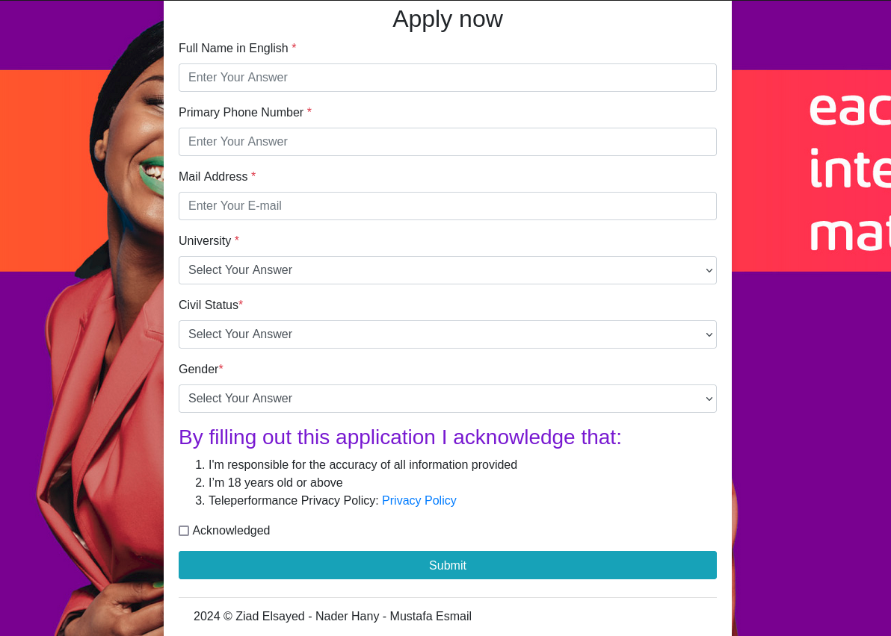

# Submission Forms

it is a forms for our friend mustafa .

## Technologies

<ul>
<li>Sqlite</li>
<li>Flask</li>
<li>Bootstrap</li>
<li>JQuery</li>
<li>Railway</li>

</ul>

## Admin form


## form example




## Getting Started

to build the application run this command

```bash
pip install -r requirements.txt
```

to run your application you hava 2 options ,
<br>
1- running it directly

```bash
python3 app.py      # for linux use this command
python.exe app.py   # for windows run this command
```

but this command will not create an http service which make ur app not descoverd when deploying it.
<br>
2- running using gunicorn

```bash
sudo gunicorn -w 4 app:app  # for linux usage
gunicorn -w 4 app:app       # for windows usage
```

using gunicorn will make your app as a service that will be discovered later by any proxy server like <a href="https://httpd.apache.org/">Apache</a> or <a href="https://nginx.org/en/">Nginx</a>

## Todo

1- get all forms on admin page.<br>
2- get all forms data on specific form.<br>
3- add the required to accept policies on the form before user submit.<br>
